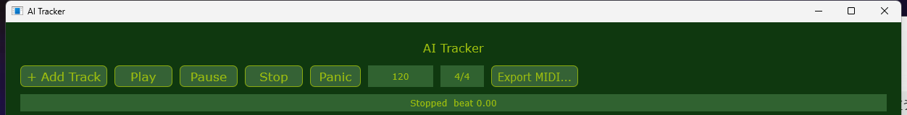
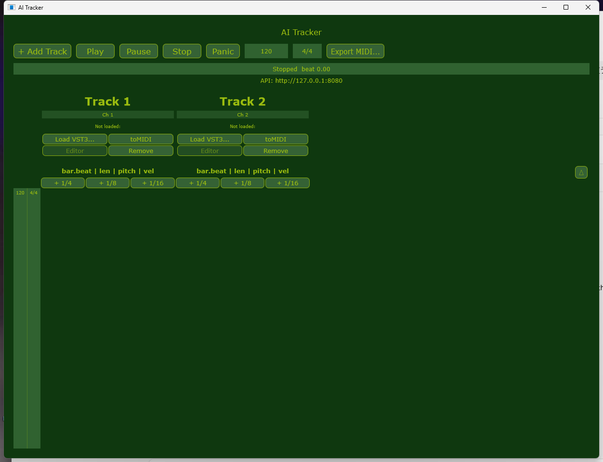

[](https://github.com/fdorceo-design/ai-tracker)

# AI Tracker

A Windows tracker-style sequencer and VSTi/Kontakt host, built so an AI can
operate it directly over a plain HTTP API while a human watches (and edits)
the same session through a Tracker-style GUI. JUCE/C++, CMake build.

Windows向けのトラッカー型シーケンサー兼VSTi/Kontaktホストです。AIがシンプルなHTTP API経由で直接操作できるよう作られており、人間はトラッカー型のGUIで同じセッションを見ながら(編集もしながら)使えます。JUCE/C++、CMakeビルド。

- **For humans**: run the app, add tracks, load an instrument (VST3 or route
  to an external MIDI/standalone synth), and either play with the GUI or let
  an AI drive it through the API below.
- **For an AI operating this app**: everything you need is `POST`/`GET`
  JSON over `http://127.0.0.1:8080` once the app is running — no code
  changes required to compose or play. Read
  **[AGENTS.md](AGENTS.md)** first; it has the API conventions that matter
  (beat numbering, bar-0 setup convention, keyswitch timing) and links to
  the rest of the reference docs below. That's the right file regardless of
  which AI/agent you are.

- **人間の方へ**: アプリを起動し、トラックを追加して、音源をロードします(VST3、または外部MIDI経由でスタンドアロン音源にルーティング)。あとはGUIで演奏するか、AIに下記のAPI経由で操作させてください。
- **このアプリを操作するAIへ**: アプリ起動後、`http://127.0.0.1:8080` に対する `POST`/`GET` のJSONだけで全て操作できます — 作曲・演奏にコード変更は不要です。まず **[AGENTS.md](AGENTS.md)** を読んでください。API上の重要な取り決め(拍の数え方、0小節目のセットアップ用途、キースイッチのタイミング)と、その他の参照資料へのリンクがまとまっています。どのAI/エージェントであっても読むべきファイルはこちらです。



## Quick start / クイックスタート

Build (CMake + Visual Studio, JUCE fetched automatically):

ビルド方法(CMake + Visual Studio、JUCEは自動取得されます):

```bash
cmake -S . -B build
cmake --build build --config Release --target AiTracker AiTrackerPluginServer
```

Run `build/AiTracker_artefacts/Release/AI Tracker.exe` — keep
`AiTrackerPluginServer.exe` in the same folder (it's copied there
automatically by the build). The app opens an HTTP API on port 8080 and a
GUI window at the same time; both operate the same live session.

`build/AiTracker_artefacts/Release/AI Tracker.exe` を実行してください — `AiTrackerPluginServer.exe` は同じフォルダに置いたままにしてください(ビルド時に自動でコピーされます)。アプリはポート8080でHTTP APIを開くと同時にGUIウィンドウも開き、両方が同じセッションを操作します。

Prebuilt binaries are also available as a zip in the repo — it only needs
`AI Tracker.exe` and `AiTrackerPluginServer.exe` together in the same
folder to run.

**[⬇ Download AI Tracker.zip](https://github.com/fdorceo-design/ai-tracker/raw/master/AI%20Tracker.zip)**

ビルド済みバイナリもリポジトリ内のZIPとして配布しています — `AI Tracker.exe` と `AiTrackerPluginServer.exe` を同じフォルダに置くだけで動作します。

**[⬇ AI Tracker.zip を直接ダウンロード](https://github.com/fdorceo-design/ai-tracker/raw/master/AI%20Tracker.zip)**

## License / ライセンス

[CC BY-NC 4.0](LICENSE) ([日本語版](LICENSE.ja.md)) — copyright is
retained; noncommercial use, redistribution, and modification are
permitted with attribution.

著作権は保持したまま、非営利に限りクレジット表記を条件に再配布・改変を許可します。

## Reference docs / 参照資料

- **[AGENTS.md](AGENTS.md)** — composition/API conventions for an AI
  operating this app (start here if you're an AI, not a human).
  (このアプリを操作するAI向けの作曲・API上の取り決め。人間ではなくAIであれば、まずここから。)
- **[MIDI.md](MIDI.md)** — MIDI import/export, and the external-MIDI-routing
  fallback for VST3 instruments that crash when hosted directly (e.g.
  Kontakt) — route to a standalone instance over a virtual MIDI cable
  instead.
  (MIDIのインポート/エクスポート、および直接ホストするとクラッシュするVST3音源(Kontaktなど)向けの外部MIDIルーティングの代替手段について。仮想MIDIケーブル経由でスタンドアロン版にルーティングします。)
- Per-instrument-library keyswitch/CC references (MIDI note numbers for
  articulation switching, which CC does what, playable ranges) — each one
  states its own octave-naming convention and verification status, since
  both vary per library/instance and get it wrong silently:
  (音源ライブラリごとのキースイッチ/CC対応表(奏法切り替えのMIDIノート番号、各CCの役割、演奏可能音域)。ライブラリ・インスタンスごとにオクターブ表記の慣習と検証状況が異なり、間違えてもエラーが出ないため、各ファイルで自分自身の慣習と検証状況を明記しています:)
  - [Kontakt-Sacconi-Keyswitches.md](Kontakt-Sacconi-Keyswitches.md)
  - [Kontakt-Spitfire-Solo-Strings-Keyswitches.md](Kontakt-Spitfire-Solo-Strings-Keyswitches.md)
  - [Kontakt-Spitfire-Symphony-Orchestra-Keyswitches.md](Kontakt-Spitfire-Symphony-Orchestra-Keyswitches.md)
  - [Kontakt-PP013-Electric-Cellist-Keyswitches.md](Kontakt-PP013-Electric-Cellist-Keyswitches.md)
  - [Kontakt-BBCSO-Professional-Keyswitches.md](Kontakt-BBCSO-Professional-Keyswitches.md)
    (work in progress; **uses a different octave convention than the others**
    — read its own convention section before using it)
    (作業中。**他のファイルとはオクターブ表記の慣習が異なる**ので、使う前に自身の慣習説明の節を読んでください。)
  - [Ample-Sound-Keyswitches/](Ample-Sound-Keyswitches/README.md) — Ample
    Sound bass/guitar/ukulele/metal libraries (24 instruments), each
    sourced directly from the official Ample Sound manual for that
    instrument. Uses `C4 = MIDI 60`.
    (Ample Soundのベース/ギター/ウクレレ/メタル音源(24種)。各ファイルとも公式Ample Soundマニュアルを出典としています。`C4 = MIDI 60` 表記を使用。)
  - [MODWHEEL-Keyswitches/](MODWHEEL-Keyswitches/README.md) — MODWHEEL
    Kontakt libraries (22 products). These generally don't publish one
    universal keyswitch map, so exact MIDI note numbers are only included
    where the product page explicitly states them.
    (MODWHEELのKontakt音源(22製品)。多くは統一されたキースイッチ表を公開していないため、公式ページに明記がある場合のみMIDIノート番号を記載しています。)
  - [Fracture-Sounds-Keyswitches/](Fracture-Sounds-Keyswitches/README.md) —
    Fracture Sounds Kontakt libraries, organized by product series (the
    free Blueprint series and the paid Main Catalog series, 50
    instruments total so far). As with MODWHEEL, exact keyswitch note
    numbers are only recorded where officially published.
    (Fracture SoundsのKontakt音源。製品シリーズごとにフォルダ分け(現在はBlueprintシリーズと有償のMain Catalogシリーズ、計50種)。MODWHEELと同様、公式に明記がある場合のみキースイッチ番号を記載しています。)
  - [Embertone-Keyswitches/](Embertone-Keyswitches/README.md) — Embertone
    Kontakt libraries (37 instruments in the current catalog). Same
    policy as MODWHEEL/Fracture Sounds: exact keyswitch numbers only
    where officially published. Note: Embertone often ships detailed
    manuals inside the installed `Documentation`/`Extras` folder rather
    than on the product page — an installed manual overrides this
    summary.
    (Embertoneのkontakt音源(現行カタログ37種)。MODWHEEL/Fracture Soundsと同様の方針。注: Embertoneは製品ページよりインストール後の`Documentation`/`Extras`フォルダに詳細マニュアルを同梱することが多く、インストール済みマニュアルがあればこの要約より優先されます。)
  - [Crow-Hill-Keyswitches/](Crow-Hill-Keyswitches/README.md) — The Crow
    Hill Company libraries (42 current non-free products, free
    instruments deliberately excluded). Same don't-guess-the-note
    policy; the installed plugin/manual is the final authority where its
    UI shows the active articulation and keyswitch location.
    (The Crow Hill Companyの音源(現行の非フリー製品42種、フリー音源は意図的に対象外)。番号を推測しない方針は共通。UIで現在の奏法とキースイッチ位置が表示されるライブラリでは、インストール済みプラグイン/マニュアルが最終的な正となります。)
  - [Impact-Soundworks-Keyswitches/](Impact-Soundworks-Keyswitches/README.md) —
    Impact Soundworks libraries, split by Kontakt edition requirement:
    Full Kontakt (34 products) and Kontakt Player compatible (58
    products) — kept as separate sets since edition compatibility
    differs per product. Same don't-guess-the-note policy.
    (Impact Soundworksの音源。必要なKontaktエディションで分類(フルKontakt版34種、Kontakt Player対応版58種)— 製品ごとに対応エディションが異なるため別セットにしています。番号を推測しない方針は共通。)
  - [Westwood-Instruments-Keyswitches/](Westwood-Instruments-Keyswitches/README.md) —
    Westwood Instruments libraries (16 current standalone products).
    **Newer Westwood instruments let the user globally enable/disable
    keyswitches and move their keyboard position**, so a factory KS
    location isn't necessarily permanent — the installed instrument's
    current mapping always takes precedence over this doc.
    (Westwood Instrumentsの音源(現行の単体製品16種)。**新しいWestwood製品ではキースイッチの全体的な有効/無効切り替えや、キーボード上の位置移動をユーザーが行える**ため、工場出荷時のキースイッチ位置が固定とは限りません — インストール済み音源の現在のマッピングが常にこのドキュメントより優先されます。)
